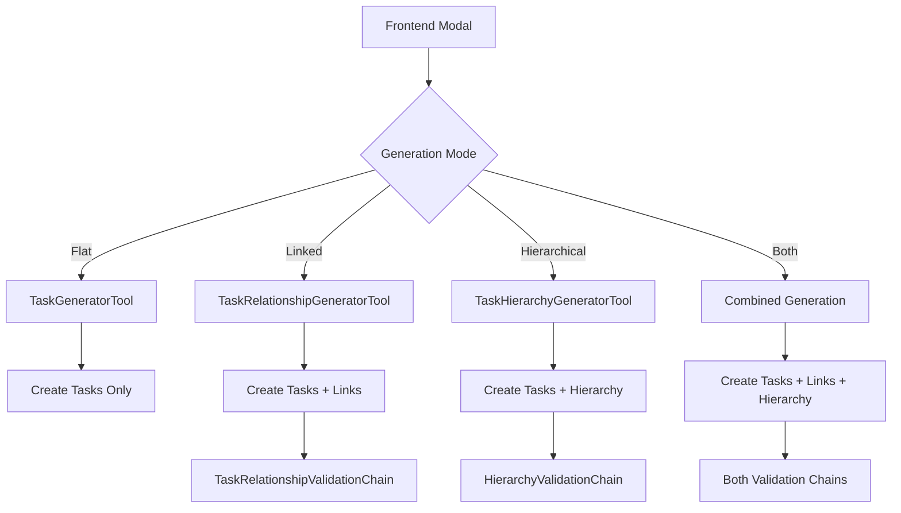

# AI-Generated Tasks with Relationships & Hierarchy Architecture

## Overview

This document outlines the architecture for extending the current AI task generation system to support relationships and hierarchy while maintaining backward compatibility with the existing flat task generation flow.

## Current State

- ✅ **Working**: AI-generated flat tasks via `TaskGeneratorTool` with LangChain v1.5
- ✅ **Available**: Comprehensive validation chains for relationships and hierarchy
- ✅ **Infrastructure**: Robust validation system in `TasksModule`

## Core Strategy: Parallel Tool Architecture

Instead of modifying the existing `TaskGeneratorTool`, create **two new specialized tools** that can be called independently or together:

1. **`TaskRelationshipGeneratorTool`** - Generates task links/relationships
2. **`TaskHierarchyGeneratorTool`** - Generates parent-child hierarchies

## Architecture Overview



## Implementation Plan

### 1. Two-Step Confirmation Flow

#### **High-Level Flow**

**Current Flow (What You Have Now):**
```
User clicks "Generate Tasks" → AI generates flat tasks → User sees preview → User clicks "Save" → Tasks created in DB
```

**New Flow (What I'm Suggesting):**
```
User clicks "Generate Linked Tasks" → AI generates tasks + relationships with placeholders → User sees preview → User clicks "Confirm" → Tasks created first → Relationships created with real IDs
```

#### **Step-by-Step Breakdown**

**Step 1: Preview Generation**
```typescript
// User clicks "Generate Linked Tasks"
POST /ai/generate-linked-tasks-preview
{
  "prompt": "Create a user authentication system",
  "projectId": "proj-123",
  "generateRelationships": true
}

// AI responds with:
{
  "tasks": [
    { "title": "Design login form", "description": "..." },
    { "title": "Implement JWT auth", "description": "..." },
    { "title": "Add password reset", "description": "..." }
  ],
  "relationships": [
    { "sourceTask": "task_1", "targetTask": "task_2", "type": "BLOCKS" },
    { "sourceTask": "task_2", "targetTask": "task_3", "type": "BLOCKS" }
  ],
  "meta": {
    "placeholderMode": true,
    "resolutionInstructions": "task_1 = Design login form, task_2 = Implement JWT auth, task_3 = Add password reset"
  }
}
```

**Step 2: User Confirmation**
```typescript
// User sees preview and clicks "Confirm"
POST /ai/confirm-linked-tasks
{
  "tasks": [...], // Same tasks from preview
  "relationships": [...], // Same relationships from preview
  "projectId": "proj-123"
}

// Backend process:
// 1. Create tasks first → Get real UUIDs
// 2. Map placeholders to real IDs
// 3. Create relationships with real IDs
// 4. Return final result

// Final response:
{
  "tasks": [
    { "id": "real-uuid-1", "title": "Design login form", ... },
    { "id": "real-uuid-2", "title": "Implement JWT auth", ... },
    { "id": "real-uuid-3", "title": "Add password reset", ... }
  ],
  "relationships": [
    { "sourceTaskId": "real-uuid-1", "targetTaskId": "real-uuid-2", "type": "BLOCKS" },
    { "sourceTaskId": "real-uuid-2", "targetTaskId": "real-uuid-3", "type": "BLOCKS" }
  ]
}
```

#### **Frontend Experience**

```typescript
const TaskGenerationModal = () => {
  const [step, setStep] = useState('generate'); // 'generate' | 'preview' | 'confirmed'
  const [preview, setPreview] = useState(null);
  const [result, setResult] = useState(null);
  
  const handleGenerate = async () => {
    // Step 1: Generate preview
    const preview = await generateLinkedTasksPreview(request);
    setPreview(preview);
    setStep('preview');
  };
  
  const handleConfirm = async () => {
    // Step 2: User confirms, create in DB
    const result = await confirmLinkedTasks(preview);
    setResult(result);
    setStep('confirmed');
  };
  
  return (
    <Modal>
      {step === 'generate' && (
        <div>
          <h3>Generate Linked Tasks</h3>
          <button onClick={handleGenerate}>Generate Preview</button>
        </div>
      )}
      
      {step === 'preview' && (
        <div>
          <h3>Preview Generated Tasks</h3>
          <TaskList tasks={preview.tasks} />
          <RelationshipDiagram relationships={preview.relationships} />
          <div>
            <button onClick={handleConfirm}>Confirm & Create</button>
            <button onClick={() => setStep('generate')}>Back to Edit</button>
          </div>
        </div>
      )}
      
      {step === 'confirmed' && (
        <div>
          <h3>Tasks Created Successfully!</h3>
          <TaskList tasks={result.tasks} />
          <RelationshipDiagram relationships={result.relationships} />
        </div>
      )}
    </Modal>
  );
};
```

#### **Complex Case: Links + Hierarchy Flow**

**Most Complex Scenario:**
```
User clicks "Generate Complex Tasks" → AI generates tasks + relationships + hierarchy with placeholders → User sees preview → User clicks "Confirm" → Tasks created first → Relationships created with real IDs → Hierarchies created with real IDs
```

**Step-by-Step for Complex Case:**

**Step 1: Preview Generation (Complex)**
```typescript
// User clicks "Generate Complex Tasks"
POST /ai/generate-complex-tasks-preview
{
  "prompt": "Create a complete e-commerce system",
  "projectId": "proj-123",
  "generateRelationships": true,
  "generateHierarchy": true
}

// AI responds with:
{
  "tasks": [
    { "title": "Design database schema", "description": "..." },
    { "title": "Create user authentication", "description": "..." },
    { "title": "Build product catalog", "description": "..." },
    { "title": "Implement shopping cart", "description": "..." },
    { "title": "Add payment processing", "description": "..." },
    { "title": "Create order management", "description": "..." }
  ],
  "relationships": [
    { "sourceTask": "task_1", "targetTask": "task_2", "type": "BLOCKS" },
    { "sourceTask": "task_2", "targetTask": "task_3", "type": "BLOCKS" },
    { "sourceTask": "task_3", "targetTask": "task_4", "type": "BLOCKS" },
    { "sourceTask": "task_4", "targetTask": "task_5", "type": "BLOCKS" },
    { "sourceTask": "task_5", "targetTask": "task_6", "type": "BLOCKS" }
  ],
  "hierarchies": [
    { "parentTask": "task_1", "childTask": "task_2" },
    { "parentTask": "task_1", "childTask": "task_3" },
    { "parentTask": "task_2", "childTask": "task_4" },
    { "parentTask": "task_3", "childTask": "task_5" }
  ],
  "meta": {
    "placeholderMode": true,
    "resolutionInstructions": "task_1 = Design database schema, task_2 = Create user authentication, task_3 = Build product catalog, task_4 = Implement shopping cart, task_5 = Add payment processing, task_6 = Create order management"
  }
}
```

**Step 2: User Confirmation (Complex)**
```typescript
// User sees preview and clicks "Confirm"
POST /ai/confirm-complex-tasks
{
  "tasks": [...], // Same tasks from preview
  "relationships": [...], // Same relationships from preview
  "hierarchies": [...], // Same hierarchies from preview
  "projectId": "proj-123"
}

// Backend process:
// 1. Create tasks first → Get real UUIDs
// 2. Map placeholders to real IDs for relationships
// 3. Map placeholders to real IDs for hierarchies
// 4. Create relationships with real IDs and validation
// 5. Create hierarchies with real IDs and validation
// 6. Return final result

// Final response:
{
  "tasks": [
    { "id": "real-uuid-1", "title": "Design database schema", ... },
    { "id": "real-uuid-2", "title": "Create user authentication", ... },
    { "id": "real-uuid-3", "title": "Build product catalog", ... },
    { "id": "real-uuid-4", "title": "Implement shopping cart", ... },
    { "id": "real-uuid-5", "title": "Add payment processing", ... },
    { "id": "real-uuid-6", "title": "Create order management", ... }
  ],
  "relationships": [
    { "sourceTaskId": "real-uuid-1", "targetTaskId": "real-uuid-2", "type": "BLOCKS" },
    { "sourceTaskId": "real-uuid-2", "targetTaskId": "real-uuid-3", "type": "BLOCKS" },
    { "sourceTaskId": "real-uuid-3", "targetTaskId": "real-uuid-4", "type": "BLOCKS" },
    { "sourceTaskId": "real-uuid-4", "targetTaskId": "real-uuid-5", "type": "BLOCKS" },
    { "sourceTaskId": "real-uuid-5", "targetTaskId": "real-uuid-6", "type": "BLOCKS" }
  ],
  "hierarchies": [
    { "parentTaskId": "real-uuid-1", "childTaskId": "real-uuid-2" },
    { "parentTaskId": "real-uuid-1", "childTaskId": "real-uuid-3" },
    { "parentTaskId": "real-uuid-2", "childTaskId": "real-uuid-4" },
    { "parentTaskId": "real-uuid-3", "childTaskId": "real-uuid-5" }
  ]
}
```

**Frontend Experience (Complex Case):**
```typescript
const ComplexTaskGenerationModal = () => {
  const [step, setStep] = useState('generate'); // 'generate' | 'preview' | 'confirmed'
  const [preview, setPreview] = useState(null);
  const [result, setResult] = useState(null);
  
  const handleGenerate = async () => {
    // Step 1: Generate complex preview
    const preview = await generateComplexTasksPreview(request);
    setPreview(preview);
    setStep('preview');
  };
  
  const handleConfirm = async () => {
    // Step 2: User confirms, create in DB
    const result = await confirmComplexTasks(preview);
    setResult(result);
    setStep('confirmed');
  };
  
  return (
    <Modal>
      {step === 'generate' && (
        <div>
          <h3>Generate Complex Tasks</h3>
          <p>Create tasks with both relationships and hierarchy</p>
          <button onClick={handleGenerate}>Generate Preview</button>
        </div>
      )}
      
      {step === 'preview' && (
        <div>
          <h3>Preview Generated Complex Tasks</h3>
          <TaskList tasks={preview.tasks} />
          <RelationshipDiagram 
            relationships={preview.relationships}
            hierarchies={preview.hierarchies}
          />
          <div>
            <button onClick={handleConfirm}>Confirm & Create</button>
            <button onClick={() => setStep('generate')}>Back to Edit</button>
          </div>
        </div>
      )}
      
      {step === 'confirmed' && (
        <div>
          <h3>Complex Tasks Created Successfully!</h3>
          <TaskList tasks={result.tasks} />
          <RelationshipDiagram 
            relationships={result.relationships}
            hierarchies={result.hierarchies}
          />
        </div>
      )}
    </Modal>
  );
};
```

### 2. New DTOs & Schemas

```typescript
// Preview DTOs (with placeholders)
export class GenerateLinkedTasksPreviewDto {
  @IsArray()
  @ValidateNested({ each: true })
  @Type(() => TaskDto)
  tasks: TaskDto[];
  
  @IsOptional()
  @IsArray()
  @ValidateNested({ each: true })
  @Type(() => TaskRelationshipPreviewDto)
  relationships?: TaskRelationshipPreviewDto[];
  
  @IsOptional()
  @IsArray()
  @ValidateNested({ each: true })
  @Type(() => TaskHierarchyPreviewDto)
  hierarchies?: TaskHierarchyPreviewDto[];
  
  @IsObject()
  meta: {
    placeholderMode: boolean;
    resolutionInstructions: string;
  };
}

export class TaskRelationshipPreviewDto {
  @IsString()
  sourceTask: string; // Placeholder like "task_1"
  
  @IsString()
  targetTask: string; // Placeholder like "task_2"
  
  @IsEnum(TaskLinkType)
  type: TaskLinkType;
}

export class TaskHierarchyPreviewDto {
  @IsString()
  parentTask: string; // Placeholder like "task_1"
  
  @IsString()
  childTask: string; // Placeholder like "task_2"
}

// Confirmation DTOs (with real data)
export class ConfirmLinkedTasksDto {
  @IsArray()
  @ValidateNested({ each: true })
  @Type(() => TaskDto)
  tasks: TaskDto[];
  
  @IsOptional()
  @IsArray()
  @ValidateNested({ each: true })
  @Type(() => TaskRelationshipPreviewDto)
  relationships?: TaskRelationshipPreviewDto[];
  
  @IsOptional()
  @IsArray()
  @ValidateNested({ each: true })
  @Type(() => TaskHierarchyPreviewDto)
  hierarchies?: TaskHierarchyPreviewDto[];
  
  @IsString()
  projectId: string;
}

// Final response DTOs (with real IDs)
export class GenerateLinkedTasksResponseDto {
  @IsArray()
  @ValidateNested({ each: true })
  @Type(() => TaskDto)
  tasks: TaskDto[];
  
  @IsOptional()
  @IsArray()
  @ValidateNested({ each: true })
  @Type(() => TaskRelationshipDto)
  relationships?: TaskRelationshipDto[];
  
  @IsOptional()
  @IsArray()
  @ValidateNested({ each: true })
  @Type(() => TaskHierarchyDto)
  hierarchies?: TaskHierarchyDto[];
}

export class TaskRelationshipDto {
  @IsString()
  sourceTaskId: string; // Real UUID
  
  @IsString()
  targetTaskId: string; // Real UUID
  
  @IsEnum(TaskLinkType)
  type: TaskLinkType;
}

export class TaskHierarchyDto {
  @IsString()
  parentTaskId: string; // Real UUID
  
  @IsString()
  childTaskId: string; // Real UUID
}
```

### 3. New AI Tools

#### TaskRelationshipGeneratorTool

```typescript
@Injectable()
export class TaskRelationshipGeneratorTool {
  constructor(
    private readonly llmProvider: LlmProviderService,
    private readonly contextService: ContextService,
    private readonly aiRedaction: AiRedactionService,
    private readonly tracing: AiTracingService,
    private readonly logger: CustomLogger,
    private readonly validateDatesTool: ValidateDatesTool,
    private readonly taskLinkService: TaskLinkService,
    private readonly taskRelationshipValidationChain: TaskRelationshipValidationChain,
    private readonly tasksService: TasksService,
  ) {}

  @Tool({ name: 'generate_task_relationships_preview' })
  async generatePreview(
    params: GenerateLinkedTasksRequestDto,
    userId?: string,
  ): Promise<GenerateLinkedTasksPreviewDto> {
    return this.tracing.withSpan('ai.taskgen.relationships.preview', async () => {
      // Generate tasks with placeholder relationships
      const aiResult = await this.generateWithPlaceholders(params);
      
      return {
        tasks: aiResult.tasks,
        relationships: aiResult.relationships,
        meta: {
          placeholderMode: true,
          resolutionInstructions: this.generateResolutionInstructions(aiResult.tasks),
        }
      };
    });
  }

  @Tool({ name: 'confirm_task_relationships' })
  async confirmAndCreate(
    params: ConfirmLinkedTasksDto,
    userId?: string,
  ): Promise<GenerateLinkedTasksResponseDto> {
    return this.tracing.withSpan('ai.taskgen.relationships.confirm', async () => {
      // Step 1: Create tasks first to get real IDs
      const createdTasks = await this.tasksService.createMany({
        tasks: params.tasks.map(task => ({
          title: task.title,
          description: task.description,
          priority: task.priority,
          dueDate: task.dueDate,
          assigneeId: task.assigneeId,
        }))
      }, params.projectId);
      
      // Step 2: Resolve placeholders to real IDs
      const resolvedRelationships = this.resolvePlaceholders(
        params.relationships || [],
        createdTasks
      );
      
      // Step 3: Create relationships with validation
      const createdRelationships = await this.createRelationships(resolvedRelationships);
      
      return {
        tasks: createdTasks,
        relationships: createdRelationships,
      };
    });
  }

  private async generateWithPlaceholders(
    params: GenerateLinkedTasksRequestDto,
  ): Promise<{ tasks: any[], relationships: any[] }> {
    const systemMessage = new SystemMessage(`
      You are a task relationship generator. Generate both tasks and their relationships.
      
      For relationships, use placeholder references:
      - "task_1" for the first task
      - "task_2" for the second task
      - etc.
      
      Available task link types: BLOCKS, IS_BLOCKED_BY, DUPLICATES, IS_DUPLICATED_BY, SPLITS_TO, SPLITS_FROM, RELATES_TO
      
      Rules:
      - Generate meaningful relationships based on task content
      - Use placeholder task references (task_1, task_2, etc.)
      - Don't create circular dependencies
      - Be conservative - only create relationships that make logical sense
    `);
    
    const userMessage = new HumanMessage(`
      Generate tasks and relationships for: ${params.prompt}
      
      Project ID: ${params.projectId}
    `);
    
    const structuredModel = chatModel.withStructuredOutput(PreviewSchema);
    const result = await structuredModel.invoke([systemMessage, userMessage]);
    
    return {
      tasks: result.tasks,
      relationships: result.relationships || [],
    };
  }

  private generateResolutionInstructions(tasks: any[]): string {
    return tasks.map((task, index) => 
      `task_${index + 1} = "${task.title}"`
    ).join('\n');
  }

  private resolvePlaceholders(
    relationships: TaskRelationshipPreviewDto[],
    tasks: Task[],
  ): TaskRelationshipDto[] {
    return relationships.map(rel => ({
      sourceTaskId: this.resolvePlaceholder(rel.sourceTask, tasks),
      targetTaskId: this.resolvePlaceholder(rel.targetTask, tasks),
      type: rel.type,
      projectId: tasks[0]?.projectId,
    }));
  }

  private resolvePlaceholder(placeholder: string, tasks: Task[]): string {
    const match = placeholder.match(/task_(\d+)/);
    if (match) {
      const index = parseInt(match[1]) - 1;
      return tasks[index]?.id || placeholder;
    }
    return placeholder;
  }

  private async createRelationships(
    relationships: TaskRelationshipDto[],
  ): Promise<TaskRelationshipDto[]> {
    const createdRelationships: TaskRelationshipDto[] = [];
    
    for (const rel of relationships) {
      try {
        // Validate relationship using existing validation chain
        const validation = await this.taskRelationshipValidationChain.validateLink({
          sourceTaskId: rel.sourceTaskId,
          targetTaskId: rel.targetTaskId,
          type: rel.type,
          projectId: rel.projectId,
        });
        
        if (validation.valid) {
          // Create the relationship
          await this.taskLinkService.createLink({
            sourceTaskId: rel.sourceTaskId,
            targetTaskId: rel.targetTaskId,
            type: rel.type,
            projectId: rel.projectId,
          });
          
          createdRelationships.push(rel);
        } else {
          this.logger.warn(`Skipping invalid relationship: ${validation.reason}`);
        }
      } catch (error) {
        this.logger.error(`Failed to create relationship: ${error.message}`);
      }
    }
    
    return createdRelationships;
  }
}
```

#### TaskHierarchyGeneratorTool

```typescript
@Injectable()
export class TaskHierarchyGeneratorTool {
  constructor(
    private readonly llmProvider: LlmProviderService,
    private readonly contextService: ContextService,
    private readonly aiRedaction: AiRedactionService,
    private readonly tracing: AiTracingService,
    private readonly logger: CustomLogger,
    private readonly validateDatesTool: ValidateDatesTool,
    private readonly taskHierarchyService: TaskHierarchyService,
    private readonly hierarchyValidationChain: HierarchyValidationChain,
  ) {}

  @Tool({ name: 'generate_task_hierarchy' })
  async generateHierarchy(
    params: GenerateLinkedTasksRequestDto,
    userId?: string,
  ): Promise<GenerateHierarchicalTasksResponseDto> {
    return this.tracing.withSpan('ai.taskgen.hierarchy.call', async () => {
      // Generate tasks first
      const tasks = await this.generateTasks(params, userId);
      
      // Generate hierarchy relationships
      const hierarchies = await this.generateTaskHierarchies(tasks, params);
      
      // Validate hierarchies using existing validation chain
      await this.validateHierarchies(hierarchies);
      
      return {
        tasks,
        hierarchies,
      };
    });
  }

  private async generateTaskHierarchies(
    tasks: TaskDto[],
    params: GenerateLinkedTasksRequestDto,
  ): Promise<TaskHierarchyDto[]> {
    // Use LangChain to generate parent-child relationships
    // Analyze task content to determine logical hierarchy
  }

  private async validateHierarchies(hierarchies: TaskHierarchyDto[]): Promise<void> {
    // Use existing HierarchyValidationChain
    for (const hierarchy of hierarchies) {
      const validation = await this.hierarchyValidationChain.validateHierarchy({
        parentTask: { id: hierarchy.parentTaskId },
        childTask: { id: hierarchy.childTaskId },
        projectId: hierarchy.projectId,
      });
      
      if (!validation.valid) {
        throw new BadRequestException(validation.reason);
      }
    }
  }
}
```

### 4. Enhanced AI Service

```typescript
@Injectable()
export class AiService {
  constructor(
    private readonly taskGeneratorTool: TaskGeneratorTool,
    private readonly taskRelationshipGeneratorTool: TaskRelationshipGeneratorTool,
    private readonly taskHierarchyGeneratorTool: TaskHierarchyGeneratorTool,
  ) {}

  // Keep existing method unchanged - NO BREAKING CHANGES
  async generateTasks(request: GenerateTasksRequestDto, userId?: string): Promise<GenerateTasksResponseDto> {
    if (process.env.AI_TOOLS_ENABLED !== 'true') {
      throw new ServiceUnavailableException({ code: 'AI_DISABLED' });
    }
    return this.taskGeneratorTool.generateTasks(request, userId);
  }

  // New methods for two-step confirmation flow
  async generateLinkedTasksPreview(request: GenerateLinkedTasksRequestDto, userId?: string): Promise<GenerateLinkedTasksPreviewDto> {
    if (process.env.AI_TOOLS_ENABLED !== 'true') {
      throw new ServiceUnavailableException({ code: 'AI_DISABLED' });
    }
    return this.taskRelationshipGeneratorTool.generatePreview(request, userId);
  }

  async confirmLinkedTasks(request: ConfirmLinkedTasksDto, userId?: string): Promise<GenerateLinkedTasksResponseDto> {
    if (process.env.AI_TOOLS_ENABLED !== 'true') {
      throw new ServiceUnavailableException({ code: 'AI_DISABLED' });
    }
    return this.taskRelationshipGeneratorTool.confirmAndCreate(request, userId);
  }

  async generateHierarchicalTasksPreview(request: GenerateLinkedTasksRequestDto, userId?: string): Promise<GenerateLinkedTasksPreviewDto> {
    if (process.env.AI_TOOLS_ENABLED !== 'true') {
      throw new ServiceUnavailableException({ code: 'AI_DISABLED' });
    }
    return this.taskHierarchyGeneratorTool.generatePreview(request, userId);
  }

  async confirmHierarchicalTasks(request: ConfirmLinkedTasksDto, userId?: string): Promise<GenerateLinkedTasksResponseDto> {
    if (process.env.AI_TOOLS_ENABLED !== 'true') {
      throw new ServiceUnavailableException({ code: 'AI_DISABLED' });
    }
    return this.taskHierarchyGeneratorTool.confirmAndCreate(request, userId);
  }
}
```

### 4. New Controller Endpoints

```typescript
@Controller('ai')
@ApiTags('AI')
@ApiBearerAuth()
@UseGuards(JwtAuthGuard)
export class AiController {
  constructor(
    private readonly aiService: AiService,
    private readonly llmProvider: LlmProviderService,
    private readonly metrics: AiMetricsService,
  ) {}

  // Keep existing endpoint unchanged - NO BREAKING CHANGES
  @Post('generate-tasks')
  @ApiOperation({ summary: 'Generate flat tasks using AI' })
  async generateTasks(
    @Body() body: GenerateTasksRequestDto,
    @CurrentUser() user: User,
  ): Promise<GenerateTasksResponseDto> {
    // Existing implementation - NO CHANGES
  }

  // New endpoints for two-step confirmation flow
  @Post('generate-linked-tasks-preview')
  @ApiOperation({ summary: 'Generate preview of tasks with relationships using AI' })
  @ApiResponse({
    status: 200,
    description: 'Tasks with relationships preview generated successfully',
    schema: {
      type: 'object',
      properties: {
        tasks: {
          type: 'array',
          items: { $ref: '#/components/schemas/TaskDto' },
        },
        relationships: {
          type: 'array',
          items: { $ref: '#/components/schemas/TaskRelationshipPreviewDto' },
        },
        meta: {
          type: 'object',
          properties: {
            placeholderMode: { type: 'boolean' },
            resolutionInstructions: { type: 'string' },
          },
        },
      },
    },
  })
  async generateLinkedTasksPreview(
    @Body() body: GenerateLinkedTasksRequestDto,
    @CurrentUser() user: User,
  ): Promise<GenerateLinkedTasksPreviewDto> {
    const start = Date.now();
    const { provider, model } = this.llmProvider.getInfo();
    this.metrics.recordRequest('/ai/generate-linked-tasks-preview', { provider, model });
    
    try {
      const result = await this.aiService.generateLinkedTasksPreview(body, user.id);
      this.metrics.recordLatency('/ai/generate-linked-tasks-preview', Date.now() - start, { provider, model });
      return result;
    } catch (e) {
      this.metrics.recordError('/ai/generate-linked-tasks-preview', e?.code || 'UNKNOWN', { provider, model });
      throw e;
    }
  }

  @Post('confirm-linked-tasks')
  @ApiOperation({ summary: 'Confirm and create tasks with relationships' })
  @ApiResponse({
    status: 200,
    description: 'Tasks with relationships created successfully',
    schema: {
      type: 'object',
      properties: {
        tasks: {
          type: 'array',
          items: { $ref: '#/components/schemas/TaskDto' },
        },
        relationships: {
          type: 'array',
          items: { $ref: '#/components/schemas/TaskRelationshipDto' },
        },
      },
    },
  })
  async confirmLinkedTasks(
    @Body() body: ConfirmLinkedTasksDto,
    @CurrentUser() user: User,
  ): Promise<GenerateLinkedTasksResponseDto> {
    const start = Date.now();
    const { provider, model } = this.llmProvider.getInfo();
    this.metrics.recordRequest('/ai/confirm-linked-tasks', { provider, model });
    
    try {
      const result = await this.aiService.confirmLinkedTasks(body, user.id);
      this.metrics.recordLatency('/ai/confirm-linked-tasks', Date.now() - start, { provider, model });
      return result;
    } catch (e) {
      this.metrics.recordError('/ai/confirm-linked-tasks', e?.code || 'UNKNOWN', { provider, model });
      throw e;
    }
  }

  @Post('generate-hierarchical-tasks-preview')
  @ApiOperation({ summary: 'Generate preview of tasks with hierarchy using AI' })
  async generateHierarchicalTasksPreview(
    @Body() body: GenerateLinkedTasksRequestDto,
    @CurrentUser() user: User,
  ): Promise<GenerateLinkedTasksPreviewDto> {
    const start = Date.now();
    const { provider, model } = this.llmProvider.getInfo();
    this.metrics.recordRequest('/ai/generate-hierarchical-tasks-preview', { provider, model });
    
    try {
      const result = await this.aiService.generateHierarchicalTasksPreview(body, user.id);
      this.metrics.recordLatency('/ai/generate-hierarchical-tasks-preview', Date.now() - start, { provider, model });
      return result;
    } catch (e) {
      this.metrics.recordError('/ai/generate-hierarchical-tasks-preview', e?.code || 'UNKNOWN', { provider, model });
      throw e;
    }
  }

  @Post('confirm-hierarchical-tasks')
  @ApiOperation({ summary: 'Confirm and create tasks with hierarchy' })
  async confirmHierarchicalTasks(
    @Body() body: ConfirmLinkedTasksDto,
    @CurrentUser() user: User,
  ): Promise<GenerateLinkedTasksResponseDto> {
    const start = Date.now();
    const { provider, model } = this.llmProvider.getInfo();
    this.metrics.recordRequest('/ai/confirm-hierarchical-tasks', { provider, model });
    
    try {
      const result = await this.aiService.confirmHierarchicalTasks(body, user.id);
      this.metrics.recordLatency('/ai/confirm-hierarchical-tasks', Date.now() - start, { provider, model });
      return result;
    } catch (e) {
      this.metrics.recordError('/ai/confirm-hierarchical-tasks', e?.code || 'UNKNOWN', { provider, model });
      throw e;
    }
  }
}
```

### 5. Updated AI Module

```typescript
@Module({
  imports: [ProjectsModule, TasksModule, UsersModule],
  controllers: [AiController],
  providers: [
    // Existing providers
    AiService,
    LlmProviderService,
    AiMetricsService,
    AiRedactionService,
    AiTracingService,
    ContextService,
    ProjectsContextAdapter,
    TasksContextAdapter,
    TeamContextAdapter,
    ProviderFactory,
    LangchainProvider,
    AiBootstrapService,
    TaskGeneratorTool,
    ValidateDatesTool,
    
    // New providers
    TaskRelationshipGeneratorTool,
    TaskHierarchyGeneratorTool,
  ],
  exports: [ContextService],
})
export class AiModule {}
```

## Frontend Integration

### Modal Component with Generation Options

```typescript
const TaskGenerationModal = () => {
  const [generationMode, setGenerationMode] = useState<'flat' | 'linked' | 'hierarchical' | 'complex'>('flat');
  
  const handleGenerate = async () => {
    const baseRequest = {
      prompt: userPrompt,
      projectId: selectedProjectId,
      // ... other params
    };
    
    switch (generationMode) {
      case 'flat':
        return generateTasks(baseRequest);
      case 'linked':
        return generateLinkedTasks({ 
          ...baseRequest, 
          generateRelationships: true 
        });
      case 'hierarchical':
        return generateHierarchicalTasks({ 
          ...baseRequest, 
          generateHierarchy: true 
        });
      case 'complex':
        return generateComplexTasks({ 
          ...baseRequest, 
          generateRelationships: true,
          generateHierarchy: true 
        });
    }
  };

  return (
    <Modal>
      <RadioGroup value={generationMode} onValueChange={setGenerationMode}>
        <RadioGroupItem value="flat">Flat Tasks</RadioGroupItem>
        <RadioGroupItem value="linked">Tasks with Relationships</RadioGroupItem>
        <RadioGroupItem value="hierarchical">Hierarchical Tasks</RadioGroupItem>
        <RadioGroupItem value="complex">Complex Tasks (Both)</RadioGroupItem>
      </RadioGroup>
      {/* ... rest of modal */}
    </Modal>
  );
};
```

## Key Benefits

1. **Zero Breaking Changes** - Existing flat task generation remains untouched
2. **Reuses Validation Logic** - Leverages existing `TaskRelationshipValidationChain` and `HierarchyValidationChain`
3. **Modular Design** - Each tool has a single responsibility
4. **Frontend Flexibility** - Can choose generation mode via modal options
5. **Gradual Rollout** - Can implement one tool at a time
6. **Consistent API** - All endpoints follow the same patterns
7. **Comprehensive Validation** - Uses existing robust validation infrastructure

## Implementation Phases

### Phase 1: Foundation
- [ ] Create new DTOs and validation schemas
- [ ] Update AI module with new providers
- [ ] Create base tool interfaces

### Phase 2: Relationship Generation
- [ ] Implement `TaskRelationshipGeneratorTool`
- [ ] Add `/ai/generate-linked-tasks` endpoint
- [ ] Add frontend support for linked tasks

### Phase 3: Hierarchy Generation
- [ ] Implement `TaskHierarchyGeneratorTool`
- [ ] Add `/ai/generate-hierarchical-tasks` endpoint
- [ ] Add frontend support for hierarchical tasks

### Phase 4: Complex Generation
- [ ] Implement combined generation logic
- [ ] Add `/ai/generate-complex-tasks` endpoint
- [ ] Add frontend support for complex tasks

### Phase 5: Polish & Testing
- [ ] Comprehensive testing
- [ ] Performance optimization
- [ ] Documentation updates

## Technical Considerations

### LangChain Integration
- Use existing `LangchainProvider` with structured output
- Leverage existing message utilities and context services
- Maintain consistent error handling and tracing

### Validation Strategy
- Reuse existing validation chains without modification
- Validate relationships and hierarchies before creation
- Provide clear error messages for validation failures

### Performance
- Parallel generation where possible
- Efficient database queries for validation
- Proper error handling and rollback

### Security
- Maintain existing authentication and authorization
- Validate user permissions for task creation
- Sanitize AI-generated content

This architecture provides a clean, extensible foundation for AI-generated task relationships and hierarchy while maintaining full backward compatibility with the existing system.
