# High-Level MCP Integration MVP Architecture

## 🎯 MVP Goal: "Universal Project Intelligence Assistant"
Build an MCP server with two killer features that work for ANY type of project:
1. **Project Health Check** - Analyze project status and identify risks
2. **Smart Task Generator** - Turn vague requirements into actionable tasks

**Universal Use Cases:**
- **Students**: Course projects, thesis work, personal learning
- **Professionals**: Work projects, side hustles, career development
- **Hobbyists**: Creative projects, home improvement, personal goals
- **Teams**: Any collaborative project regardless of domain

## 🧠 Universal Context Sources
- **Projects**: Descriptions, domain, scope, timeline, resources
- **Tasks**: Titles, descriptions, status, effort, dependencies
- **Attachments**: Documents, images, references, notes
- **Team/People**: Skills, roles, availability, collaboration patterns
- **Relations**: Task dependencies, project phases, milestones
- **History**: Completion patterns, lessons learned, bottlenecks

**Domain-Agnostic Examples:**
- **Student**: "CS 101 Final Project" → tasks about research, coding, documentation
- **Professional**: "Q4 Marketing Campaign" → tasks about design, content, analytics
- **Hobbyist**: "Garden Renovation" → tasks about planning, materials, execution
- **Team**: "Product Launch" → tasks across design, development, marketing, operations

## 🏗️ System Architecture (MCP-Nest Approach)

```mermaid
flowchart TD
    U[👤 User] -->|1-request| FE[🖥️ React Frontend]
    FE -->|2-http| API[⚡ NestJS API + MCP Server]

    subgraph UnifiedBackend["🔒 Unified Backend (NestJS + MCP-Nest)"]
        API -->|3a-project| PS[📊 Projects Service]
        API -->|3b-tasks| TS[📋 Tasks Service]
        API -->|3c-context| CS[📈 Context Service]
        
        subgraph MCPTools["🧠 MCP Tools (via @Tool decorators)"]
            PHT[📊 Project Health Tool]
            TGT[📋 Task Generator Tool]
        end
        
        PS -->|4a-data| PHT
        TS -->|4b-data| PHT
        CS -->|4c-context| PHT
        
        PS -->|5a-data| TGT
        TS -->|5b-data| TGT
        CS -->|5c-context| TGT
    end

    subgraph External["🌐 External AI"]
        LLM[🤖 LLM Provider<br/>Mistral/OpenAI]
    end

    PHT -->|6-llm-call| LLM
    TGT -->|7-llm-call| LLM
    LLM -->|8-response| PHT
    LLM -->|9-response| TGT

    PHT -->|10-result| API
    TGT -->|11-result| API
    API -->|12-json| FE
    FE -->|13-display| U

    classDef user fill:#e1f5fe
    classDef frontend fill:#f3e5f5
    classDef backend fill:#e8f5e8
    classDef mcp fill:#fff8e1
    classDef external fill:#fff3e0

    class U user
    class FE frontend
    class API,PS,TS,CS backend
    class PHT,TGT mcp
    class LLM external
```



## 🔮 Phase 2: Enhanced with Vector Search (Supabase)

```mermaid
flowchart TD
    U[👤 User] -->|1-request| FE[🖥️ React Frontend]
    FE -->|2-http| API[⚡ NestJS API + MCP Server]

    subgraph EnhancedBackend["🔒 Enhanced Backend (NestJS + MCP-Nest + Vector)"]
        API -->|3a-project| PS[📊 Projects Service]
        API -->|3b-tasks| TS[📋 Tasks Service]
        API -->|3c-context| CS[📈 Context Service]
        
        subgraph MCPTools["🧠 Enhanced MCP Tools"]
            PHT[📊 Project Health Tool]
            TGT[📋 Task Generator Tool]
        end
        
        subgraph VectorLayer["🔍 Vector Search Layer"]
            VS[📚 Vector Service]
            VD[🗄️ Document Embeddings]
        end
        
        PS -->|4a-data| PHT
        TS -->|4b-data| PHT
        CS -->|4c-context| PHT
        VS -->|4d-semantic| PHT
        
        PS -->|5a-data| TGT
        TS -->|5b-data| TGT
        CS -->|5c-context| TGT
        VS -->|5d-semantic| TGT
        
        VD -->|6-embeddings| VS
    end

    subgraph Supabase["🗄️ Supabase (PostgreSQL + Vector)"]
        DB[📊 Projects & Tasks]
        VDB[🔍 Vector Database]
        DB -.->|7-sync| VDB
    end

    subgraph External["🌐 External AI"]
        LLM[🤖 LLM Provider<br/>Mistral/OpenAI]
        EMB[🧮 Embedding Service<br/>OpenAI/Mistral]
    end

    PHT -->|8-llm-call| LLM
    TGT -->|9-llm-call| LLM
    VS -->|10-embed| EMB
    LLM -->|11-response| PHT
    LLM -->|12-response| TGT
    EMB -->|13-vectors| VS

    PHT -->|14-result| API
    TGT -->|15-result| API
    API -->|16-json| FE
    FE -->|17-display| U

    API -->|18-query| DB
    VS -->|19-vector-search| VDB

    classDef user fill:#e1f5fe
    classDef frontend fill:#f3e5f5
    classDef backend fill:#e8f5e8
    classDef mcp fill:#fff8e1
    classDef vector fill:#f0f8ff
    classDef database fill:#f3e5f5
    classDef external fill:#fff3e0

    class U user
    class FE frontend
    class API,PS,TS,CS backend
    class PHT,TGT mcp
    class VS,VD vector
    class DB,VDB database
    class LLM,EMB external
```



## 🔧 Core Components (MCP-Nest Approach)

### Frontend Layer
- **React Components**: Project health dashboard + task generator UI
- **HTTP Client**: Simple API calls to unified NestJS endpoints
- **Form Management**: Project selection + requirement input

### Unified Backend (NestJS + MCP-Nest)
- **REST Controllers**: Traditional API endpoints for frontend
- **MCP Tools**: `@Tool()` decorated services for AI integration
- **Existing Services**: Reuse ProjectsService, TasksService, etc.
- **Context Service**: Aggregates project/team data
- **LLM Integration**: Direct OpenAI/Mistral calls from tools

### MCP Tools (via @Tool decorators)
- **ProjectHealthTool**: `@Tool()` decorated service for health analysis
- **TaskGeneratorTool**: `@Tool()` decorated service for task generation
- **Zod Validation**: Automatic parameter validation
- **Progress Updates**: Real-time progress for long operations

### Data Layer
- **Existing Services**: ProjectsService, TasksService, UsersService
- **Database**: Existing PostgreSQL with project/task data
- **Authentication**: Existing JWT auth system

## 🔄 Data Flow

### **Project Health Check Flow**
1. **User Request**: Select project and click "Health Check"
2. **Context Gathering**: Backend collects project data, tasks, team info
3. **MCP Call**: Send structured project context to MCP server
4. **LLM Processing**: AI analyzes project health and identifies risks
5. **Response**: Return health score + insights + recommendations
6. **Display**: Show health dashboard with actionable insights

### **Task Generator Flow**
1. **User Input**: Enter vague requirement (e.g., "Add user authentication")
2. **Context Gathering**: Collect project tech stack, team skills, similar tasks
3. **MCP Call**: Send requirement + context to MCP server
4. **LLM Processing**: AI generates specific tasks with estimates and assignments
5. **Response**: Return structured task list with dependencies
6. **Display**: Show generated tasks ready to be added to project

## 🔬 Exploration Areas

### **Context-Aware Analysis**
- **Project Health**: Identify bottlenecks, risks, and opportunities
- **Team Dynamics**: Analyze collaboration patterns and workload distribution
- **Technical Debt**: Spot recurring issues and architectural concerns
- **Timeline Predictions**: Forecast completion based on historical patterns

### **Intelligent Insights**
- **Pattern Recognition**: Find hidden connections between tasks/projects
- **Resource Optimization**: Suggest better team assignments and priorities
- **Risk Assessment**: Predict potential blockers and delays
- **Knowledge Extraction**: Surface insights from attachments and discussions

### **Interactive Tools**
- **Natural Language Queries**: "What's blocking the frontend team?"
- **Smart Recommendations**: "Based on similar projects, consider..."
- **Automated Reporting**: Generate project summaries and status updates
- **Code Analysis**: Review attachments for technical insights

## 🔒 Security Principles

- **No Direct LLM Access**: Frontend never calls LLM APIs directly
- **JWT Authentication**: Secure API endpoints
- **Context Isolation**: Project data scoped to authenticated users
- **Rate Limiting**: Prevents API abuse

## 📊 Success Metrics

- **User Value**: Instant actionable subtasks
- **Technical**: <3s response time, 99% uptime
- **Cost**: <$50/month operational cost
- **Quality**: 80%+ user satisfaction with generated tasks

## 🚀 Deployment Strategy

- **Frontend**: Vercel (React + CDN)
- **API**: Fly.io (NestJS + PostgreSQL)
- **MCP Server**: Railway (Node.js + LLM integration)
- **Monitoring**: Built-in platform metrics

## 🧪 MCP Server Tools (Exploratory)

### **MCP-Nest Implementation (Two Killer Features)**
```typescript
// Project Health Tool
@Injectable()
export class ProjectHealthTool {
  constructor(
    private projectsService: ProjectsService,
    private tasksService: TasksService,
    private contextService: ContextService
  ) {}

  @Tool({
    name: 'project_health_check',
    description: 'Analyze any project status, identify risks, and provide actionable insights',
    parameters: z.object({
      projectId: z.string(),
      projectType: z.enum(['academic', 'professional', 'personal', 'team']).default('professional'),
      includeRecommendations: z.boolean().default(true)
    })
  })
  async checkHealth({ projectId, projectType, includeRecommendations }, context: Context) {
    // Use existing services!
    const project = await this.projectsService.findOne(projectId);
    const tasks = await this.tasksService.findByProject(projectId);
    const teamContext = await this.contextService.getTeamContext(projectId);
    
    // Your existing business logic + AI analysis
    const healthScore = this.calculateHealthScore(project, tasks, teamContext);
    const risks = this.identifyRisks(project, tasks, teamContext);
    
    return {
      healthScore,
      risks,
      recommendations: includeRecommendations ? this.generateRecommendations(project, tasks, projectType) : []
    };
  }
}

// Task Generator Tool
@Injectable()
export class TaskGeneratorTool {
  constructor(
    private projectsService: ProjectsService,
    private tasksService: TasksService,
    private contextService: ContextService
  ) {}

  @Tool({
    name: 'generate_tasks_from_requirement',
    description: 'Turn any vague requirement into specific, actionable tasks with estimates and assignments',
    parameters: z.object({
      projectId: z.string(),
      requirement: z.string(),
      projectType: z.enum(['academic', 'professional', 'personal', 'team']).default('professional'),
      priority: z.enum(['LOW', 'MEDIUM', 'HIGH']).default('MEDIUM')
    })
  })
  async generateTasks({ projectId, requirement, projectType, priority }, context: Context) {
    const project = await this.projectsService.findOne(projectId);
    const teamContext = await this.contextService.getTeamContext(projectId);
    const similarTasks = await this.tasksService.findSimilar(requirement, projectId);
    
    // AI-powered task generation using project context
    return this.generateTaskBreakdown(requirement, project, teamContext, similarTasks, projectType);
  }
}
```

### **Universal Example Usage**
```typescript
// Student Project Health Check
const studentHealth = await mcpClient.callTool({
  name: 'project_health_check',
  arguments: { 
    projectId: 'cs101-final',
    projectType: 'academic'
  }
});
// Returns: "Project Health: 65/100. Risks: Research phase behind schedule, need to start coding soon"

// Hobby Project Task Generation
const hobbyTasks = await mcpClient.callTool({
  name: 'generate_tasks_from_requirement',
  arguments: { 
    projectId: 'garden-renovation',
    requirement: 'Create a sustainable vegetable garden',
    projectType: 'personal'
  }
});
// Returns: Tasks about soil preparation, plant selection, irrigation setup, maintenance schedule

// Professional Project Health Check
const workHealth = await mcpClient.callTool({
  name: 'project_health_check',
  arguments: { 
    projectId: 'q4-campaign',
    projectType: 'professional'
  }
});
// Returns: "Project Health: 82/100. Risks: Design approval delayed, need to accelerate content creation"
```


## 🎓 Learning Objectives

- **MCP Protocol**: Understand how to build and deploy MCP servers
- **Context Engineering**: Learn to structure rich data for LLM consumption
- **Prompt Design**: Experiment with different prompting strategies
- **Tool Composition**: Build modular AI tools that can be combined
- **Real-world Integration**: Connect AI capabilities to existing applications

## 🔮 Phase 2: Vector Search Enhancement (Supabase)

### **Enhanced Capabilities**
- **Semantic Search**: Find similar tasks, issues, and solutions across projects
- **Intelligent Context**: Richer project analysis using historical data patterns
- **Document Intelligence**: Process and search through project attachments
- **Pattern Recognition**: Discover hidden insights from project history

### **Supabase Vector Integration**
- **Local Development**: `supabase start` for Docker-based local development
- **Production Deployment**: Managed Supabase cloud with vector support
- **Same Database**: PostgreSQL with vector extensions in both environments
- **Cost Effective**: No separate vector DB infrastructure needed

### **Enhanced MCP Tools**
```typescript
// Phase 2: Enhanced with vector searcha 
@Tool({ name: 'project_health_check' })
async checkHealth({ projectId, projectType }) {
  const project = await this.projectsService.findOne(projectId);
  const tasks = await this.tasksService.findByProject(projectId);
  
  // NEW: Semantic search for similar issues
  const similarIssues = await this.vectorService.findSimilar(
    `project health risks ${project.name}`,
    { projectId, limit: 5 }
  );
  
  return this.analyzeWithLLM(project, tasks, similarIssues, projectType);
}
```

### **Development Workflow**
- **Phase 1**: MCP-Nest + existing data (fast shipping)
- **Phase 2**: Add Supabase vector capabilities (enhanced intelligence)
- **Local Dev**: `supabase start` for development
- **Production**: Deploy to Supabase cloud
