# Task Relationship Validation Schema

## Overview

This document defines the comprehensive validation rules and business logic for task relationships in the project management system. It covers both task links and task hierarchy relationships, ensuring data integrity and business rule compliance.

## 📚 Documentation Structure

- **[Task Relationship Rules](./task-relationship-rules.md)** - User-friendly guide with examples and common scenarios
- **[Task Relationship Cheat Sheet](./task-relationship-cheatsheet.md)** - Quick reference for developers and users
- **This Document** - Complete technical specification and implementation details

## Core Business Rules

### 1. One Relationship Per Pair Rule
**Rule**: Only one relationship (of any type) can exist between any two tasks.

**Implementation**: `OneRelationshipPerPairValidator`
- Prevents multiple links between the same task pair
- Prevents hierarchy relationships when links exist
- Prevents links when hierarchy relationships exist
- Works bidirectionally (A→B and B→A are considered the same pair)

### 2. Same Project Rule
**Rule**: All related tasks must belong to the same project.

**Implementation**: `SameProjectValidator`
- Validates `sourceTask.projectId === targetTask.projectId`
- Applied to all relationship types

### 3. Self-Linking Prevention
**Rule**: Tasks cannot be linked to themselves.

**Implementation**: `SelfLinkingValidator` / `SelfHierarchyValidator`
- Prevents `sourceTaskId === targetTaskId`
- Applied to both links and hierarchy

## Task Link Validation Rules

### Link Types
- `RELATES_TO`: General relationship between tasks
- `BLOCKS`: Source task blocks target task completion
- `DUPLICATES`: Tasks are duplicates of each other

### Type-Specific Rules

#### BLOCKS Links
**Rule**: Parent tasks cannot block their child tasks.

**Implementation**: `BlocksTypeValidator`
- Prevents BLOCKS links where source is parent of target
- Prevents BLOCKS links where target is parent of source
- Business rationale: Child tasks should complete independently

#### DUPLICATES Links
**Rule**: Tasks in parent-child relationships cannot be duplicates.

**Implementation**: `DuplicatesTypeValidator`
- Prevents DUPLICATES links between parent and child tasks
- Business rationale: Parent and child tasks serve different purposes

### Global Link Rules

#### Link Limit
**Rule**: Maximum 20 links per task.

**Implementation**: `LinkLimitValidator`
- Configurable limit (currently 20)
- Prevents performance issues and complexity

#### Circular Dependency Prevention
**Rule**: Links cannot create circular dependencies.

**Implementation**: `CircularDependencyValidator`
- Uses `CircularDependencyDetector` to detect cycles
- Prevents infinite loops in task dependencies

## Task Hierarchy Validation Rules

### Hierarchy Structure
- **Parent-Child**: One task is a parent of another
- **Tree Structure**: Hierarchical organization of tasks
- **Depth Limit**: Maximum hierarchy depth (configurable)

### Hierarchy-Specific Rules

#### Self-Hierarchy Prevention
**Rule**: Tasks cannot be their own parent or child.

**Implementation**: `SelfHierarchyValidator`
- Prevents `parentTaskId === childTaskId`

#### Circular Hierarchy Prevention
**Rule**: Hierarchy cannot create circular parent-child relationships.

**Implementation**: `CircularHierarchyValidator`
- Prevents A→B→A type cycles
- Ensures tree structure integrity

#### Hierarchy Depth Limit
**Rule**: Maximum hierarchy depth to prevent excessive nesting.

**Implementation**: `HierarchyDepthValidator`
- Configurable depth limit
- Prevents UI/UX issues with deep nesting

#### Hierarchy-Link Conflict Prevention
**Rule**: Tasks with existing links cannot be in parent-child relationships.

**Implementation**: `LinkConflictValidatorForHierarchy`
- Prevents hierarchy creation when links exist
- Prevents link creation when hierarchy exists
- Enforces "one relationship per pair" rule

## Validation Architecture

### Chain of Responsibility Pattern
The validation system uses a chain of responsibility pattern with two main chains:

#### 1. Task Relationship Validation Chain
**Purpose**: Validates task link creation
**Order** (critical - order matters):
1. `SameProjectValidator`
2. `SelfLinkingValidator`
3. `OneRelationshipPerPairValidator`
4. `LinkLimitValidator`
5. `CircularDependencyValidator`
6. `HierarchyConflictValidatorHandler`

**Type-Specific Validators** (Strategy Pattern):
- `BlocksTypeValidator` (for BLOCKS links)
- `DuplicatesTypeValidator` (for DUPLICATES links)

#### 2. Hierarchy Validation Chain
**Purpose**: Validates task hierarchy creation
**Order** (critical - order matters):
1. `SelfHierarchyValidator`
2. `CircularHierarchyValidator`
3. `HierarchyDepthValidator`
4. `HierarchyConflictValidator`
5. `LinkConflictValidatorForHierarchy`

### Validation Flow

```mermaid
graph TD
    A[Create Relationship Request] --> B{Relationship Type}
    B -->|Link| C[Task Relationship Chain]
    B -->|Hierarchy| D[Hierarchy Validation Chain]
    
    C --> C1[Same Project]
    C1 --> C2[Self Linking]
    C2 --> C3[One Per Pair]
    C3 --> C4[Link Limit]
    C4 --> C5[Circular Dependency]
    C5 --> C6[Hierarchy Conflict]
    C6 --> C7{Link Type}
    C7 -->|BLOCKS| C8[Blocks Validator]
    C7 -->|DUPLICATES| C9[Duplicates Validator]
    C7 -->|RELATES_TO| C10[Success]
    C8 --> C10
    C9 --> C10
    
    D --> D1[Self Hierarchy]
    D1 --> D2[Circular Hierarchy]
    D2 --> D3[Depth Limit]
    D3 --> D4[Hierarchy Conflict]
    D4 --> D5[Link Conflict]
    D5 --> D6[Success]
    
    C10 --> E[Create Relationship]
    D6 --> E
    
    C1 -->|❌| F[Validation Error]
    C2 -->|❌| F
    C3 -->|❌| F
    C4 -->|❌| F
    C5 -->|❌| F
    C6 -->|❌| F
    C8 -->|❌| F
    C9 -->|❌| F
    
    D1 -->|❌| F
    D2 -->|❌| F
    D3 -->|❌| F
    D4 -->|❌| F
    D5 -->|❌| F
```



### Class Architecture Diagram


## Error Handling

### Error Messages
All validation errors use i18n keys for internationalization:

```json
{
  "errors": {
    "task_links": {
      "duplicate_relationship": "A relationship already exists between these tasks",
      "link_limit_exceeded": "Maximum number of links per task exceeded",
      "circular_dependency": "This link would create a circular dependency",
      "hierarchy_conflict": "Tasks with existing relationships cannot be in a parent-child hierarchy"
    },
    "task_hierarchy": {
      "self_hierarchy": "A task cannot be its own parent or child",
      "circular_hierarchy": "This hierarchy would create a circular relationship",
      "depth_limit_exceeded": "Maximum hierarchy depth exceeded",
      "link_conflict": "Tasks with existing links cannot be in a parent-child hierarchy"
    }
  }
}
```

### Error Response Format
```json
{
  "message": "Human-readable error message",
  "error": "Error Type",
  "statusCode": 400
}
```

## Configuration

### Environment Variables
- `TASK_LINK_LIMIT`: Maximum links per task (default: 20)
- `HIERARCHY_DEPTH_LIMIT`: Maximum hierarchy depth (default: 10)

### Database Constraints
- Unique constraint on `(sourceTaskId, targetTaskId)` in `task_links`
- Unique constraint on `(parentTaskId, childTaskId)` in `task_hierarchy`
- Foreign key constraints to ensure referential integrity

## API Endpoints

### Task Links
- `POST /api/v1/projects/:projectId/tasks/:taskId/links` - Create link
- `GET /api/v1/projects/:projectId/tasks/:taskId/links` - List links
- `GET /api/v1/projects/:projectId/tasks/:taskId/links/detailed` - List links with full task details
- `DELETE /api/v1/projects/:projectId/tasks/:taskId/links/:linkId` - Delete link

### Task Hierarchy
- `POST /api/v1/projects/:projectId/tasks/:parentTaskId/hierarchy/:childTaskId` - Create hierarchy
- `GET /api/v1/projects/:projectId/tasks/:taskId/hierarchy` - Get hierarchy
- `DELETE /api/v1/projects/:projectId/tasks/:parentTaskId/hierarchy/:childTaskId` - Delete hierarchy

## Testing Strategy

### Unit Tests
- Each validator should have comprehensive unit tests
- Test all validation scenarios (success and failure cases)
- Mock dependencies appropriately

### Integration Tests
- Test complete validation chains
- Test API endpoints with various scenarios
- Test error handling and response formats

### Manual Testing Checklist
- [ ] Create first relationship (should succeed)
- [ ] Try duplicate relationship (should fail)
- [ ] Try reverse direction (should fail)
- [ ] Try hierarchy with existing link (should fail)
- [ ] Try link with hierarchy conflict (should fail)
- [ ] Test different task pairs (should succeed)
- [ ] Test all link types with various scenarios
- [ ] Test hierarchy depth limits
- [ ] Test circular dependency prevention

## Future Enhancements

### Potential Additions
1. **Soft Dependencies**: Links that don't block but suggest order
2. **Conditional Links**: Links that apply only under certain conditions
3. **Link Weights**: Priority or importance of relationships
4. **Temporal Relationships**: Time-based relationship constraints
5. **Bulk Operations**: Create/delete multiple relationships at once

### Performance Considerations
1. **Caching**: Cache validation results for frequently accessed tasks
2. **Batch Validation**: Validate multiple relationships in single operation
3. **Database Indexing**: Optimize queries for relationship lookups
4. **Lazy Loading**: Load relationships only when needed

## Maintenance

### Regular Tasks
1. **Review Validation Rules**: Quarterly review of business rules
2. **Performance Monitoring**: Monitor validation performance
3. **Error Analysis**: Analyze validation failures for patterns
4. **Rule Updates**: Update rules based on business requirements

### Documentation Updates
1. **Schema Versioning**: Version control for schema changes
2. **Change Log**: Document all rule changes
3. **Migration Guide**: Guide for updating validation rules
4. **Training Materials**: Documentation for new team members

---

*Last Updated: 2025-09-19*
*Version: 1.0.0*
*Author: Development Team*
